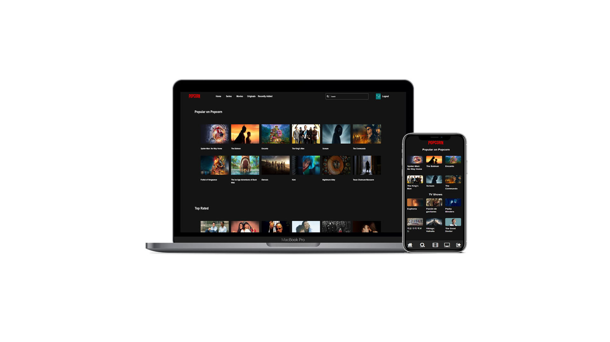
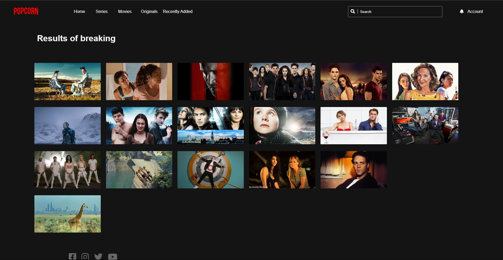
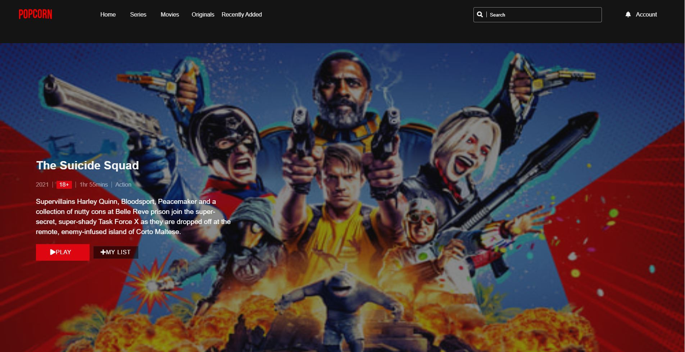
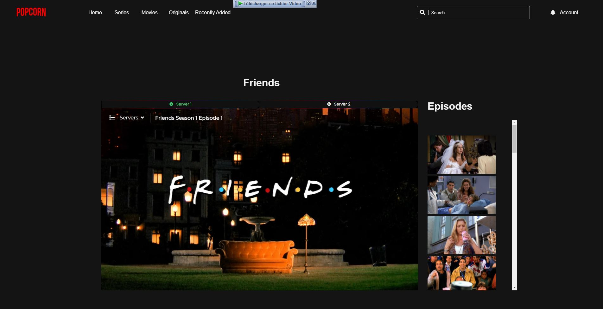

<h1 align="center">
  Popcorn
   
</h1>

<h3 align="center">
Popcorn is a modern web application that allows you to search, view and stream movies and television shows found on the internet.
</h3>
 

 

# Technical Details
This application is web-based, For all the front-end components, [ReactJs](https://reactjs.org/) is used and the player is completely HTML5-based. The application is essentially split into Grails for a REST-API, and ReactJs for the frontend.

Popcorn uses the [awesome API](https://www.themoviedb.org/documentation/api) from [theMovieDatabase](https://www.themoviedb.org) for all media-metadata.

# Roadmap
Popcorn is still very much a work-in-progress. We will be adding new features and bug-fixes often, but this is a hobby project for the core-contributors, so the time that we can spend on it is limited.

For all our feature and bug tracking, we use the [Issues Section](https://github.com/AzouKr/Movie-Streaming-Site/issues). Popcorn's 'roadmap' is currently to work through the feature requests and improvements that are in the issue tracker.  Take a look at the milestones for what we intend to add for upcoming releases.

# Some Images

  

  

 
